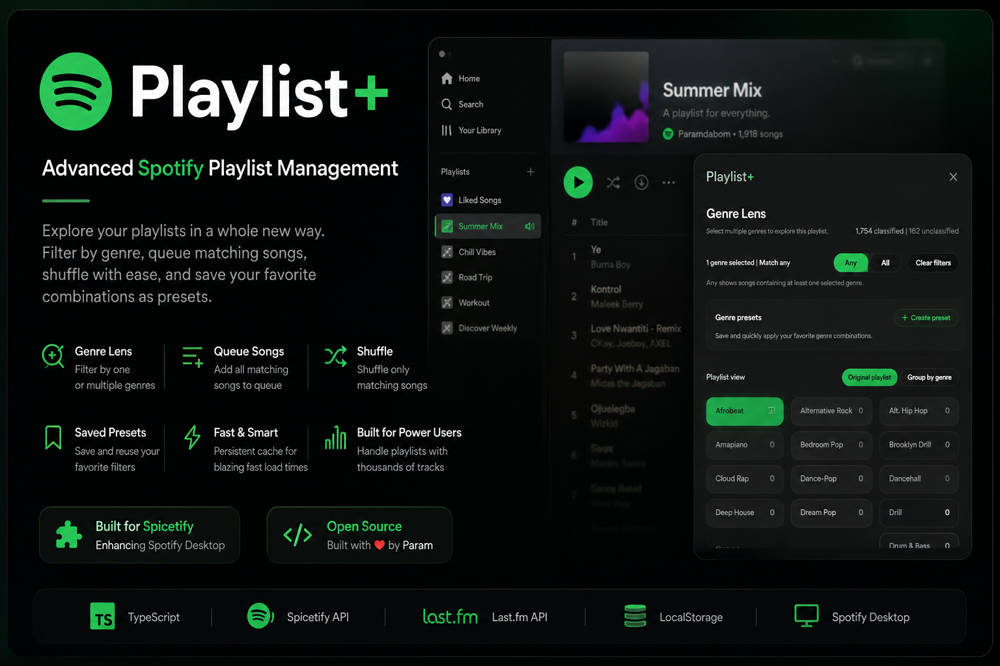
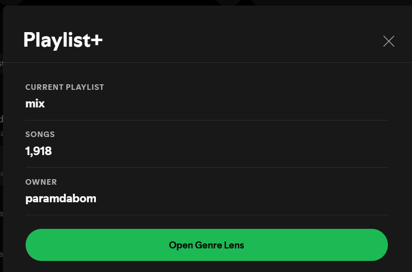
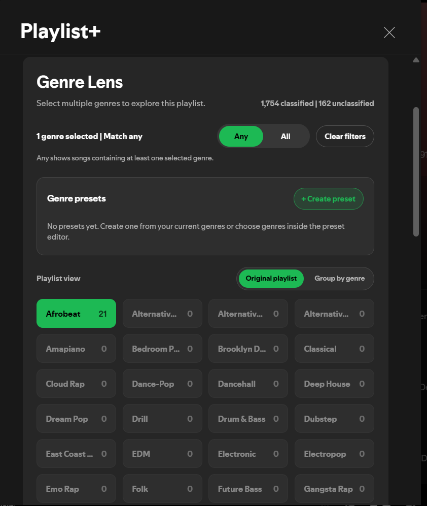

# Playlist+

  

Advanced Spotify playlist management for Spicetify.

Playlist+ transforms large Spotify playlists into an interactive browsing experience with intelligent genre classification, powerful filtering, smart queue controls, and reusable genre presets.
---

## Features

- 🎵 Intelligent genre classification using Last.fm
- 🔍 Filter playlists by one or multiple genres
- ⚡ Match Any / Match All filtering
- 📚 Queue every matching song
- 🔀 Shuffle only matching songs
- 💾 Saved genre presets
- 🚀 Persistent genre cache for fast loading
- 📈 Supports playlists with thousands of tracks

---

## Screenshots

### Playlist Overview

---

### Genre Lens

---

### Filtered Songs

---

## Tech Stack

- TypeScript
- Spicetify API
- Last.fm API
- LocalStorage
- Spotify Desktop

---

## Why I Built It

Spotify makes it easy to build huge playlists, but difficult to explore them.

I wanted to browse playlists by genre without permanently reorganizing them or creating dozens of separate playlists.

Playlist+ adds a Genre Lens directly inside Spotify that lets users temporarily reorganize, filter, queue, and shuffle music based on genre while leaving the original playlist untouched.

---

## Future Plans

- Custom genre collections
- Playlist statistics
- Genre analytics
- Similar artist recommendations
- Better classification engine
- Additional sorting modes

---

## Author

Built by **Param Kathiravan**.